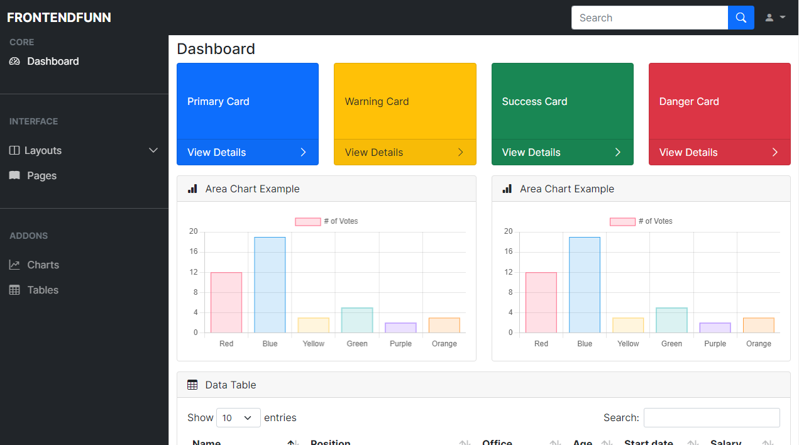

# Bootstrap 5 Admin Dashbaord Template

# 👉 Subscribe to My Channel [💙❤️Youtube❤️💙](https://www.youtube.com/channel/UCpOHt5d6GG-mvo-_pU06rhQ?sub_confirmation=1)

---

## List of Components used in this Tutorial

| Component Name  |                                          Docs                                          |
| --------------- | :------------------------------------------------------------------------------------: |
| Navbar          | [Navbar Docs](https://getbootstrap.com/docs/5.0/components/navbar/#supported-content)  |
| Collapse        |    [Collapse Docs](https://getbootstrap.com/docs/5.0/components/collapse/#example)     |
| Offcanvas       |   [Offcanvas Docs](https://getbootstrap.com/docs/5.0/components/offcanvas/#examples)   |
| Card            |      [Card Docs](https://getbootstrap.com/docs/5.0/components/card/#card-styles)       |
| Input Group     | [Input Group Docs](https://getbootstrap.com/docs/5.0/forms/input-group/#button-addons) |
| Bootstrap Icons |             [Bootstrap Icons Docs](https://icons.getbootstrap.com/#icons)              |
| Chart.js        |          [Chart.js Docs](https://www.chartjs.org/docs/latest/charts/bar.html)          |
| DataTables      |                       [DataTables Docs](https://datatables.net/)                       |

### Made with ❤️ - by [FrontEndFunn](https://www.youtube.com/channel/UCpOHt5d6GG-mvo-_pU06rhQ?sub_confirmation=1)
